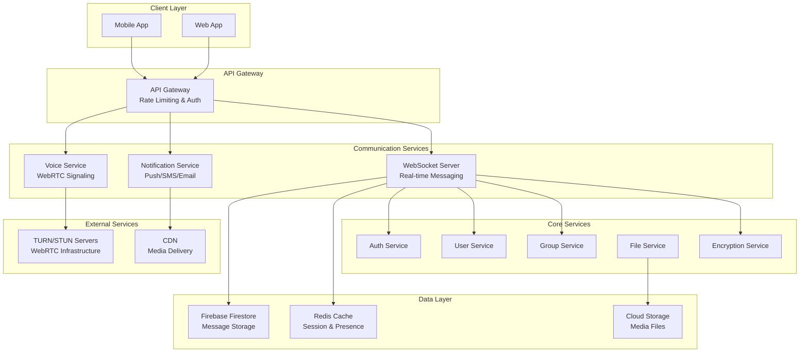

# Design Document: TALOWA In-App Communication System

## Overview

The TALOWA In-App Communication System is a comprehensive real-time messaging and voice calling platform designed specifically for land rights activism. This system integrates seamlessly with the existing TALOWA app architecture, providing secure, scalable communication capabilities for 5+ million users across rural and urban areas of Telangana.

The system leverages modern technologies including WebSocket connections for real-time messaging, WebRTC for peer-to-peer voice calling, end-to-end encryption for security, and Firebase for reliable message storage and offline synchronization. The design prioritizes user privacy, data sovereignty, and features specifically tailored for grassroots activism.

## Architecture

### High-Level System Architecture



### Technology Stack

#### Backend Technologies
- **WebSocket Server**: Node.js with Socket.IO for real-time bidirectional communication
- **Voice Signaling**: Node.js with WebRTC signaling server for voice call coordination
- **Database**: Firebase Firestore for message persistence and offline sync
- **Cache**: Redis for session management, presence tracking, and message queuing
- **File Storage**: Firebase Cloud Storage with CDN for media files
- **Authentication**: Firebase Auth integrated with existing TALOWA auth system

#### Frontend Technologies
- **Flutter**: Cross-platform mobile app with WebSocket and WebRTC support
- **WebRTC**: For peer-to-peer voice calling with fallback to relay servers
- **Local Storage**: SQLite for offline message storage and sync
- **Push Notifications**: Firebase Cloud Messaging (FCM) for real-time alerts

#### Infrastructure
- **TURN/STUN Servers**: Coturn servers for WebRTC NAT traversal
- **Load Balancers**: Nginx for WebSocket connection distribution
- **CDN**: Firebase CDN for global media file delivery
- **Monitoring**: Firebase Analytics + custom performance monitoring

## Components and Interfaces

### 1. Real-Time Messaging Component

#### WebSocket Connection Manager
```typescript
interface WebSocketManager {
  // Connection lifecycle
  connect(userId: string, authToken: string): Promise<WebSocketConnection>;
  disconnect(connectionId: string): Promise<void>;
  reconnect(connectionId: string): Promise<void>;
  
  // Message handling
  sendMessage(message: MessagePayload): Promise<MessageDeliveryStatus>;
  subscribeToMessages(callback: (message: IncomingMessage) => void): void;
  
  // Presence management
  updatePresence(status: PresenceStatus): Promise<void>;
  subscribeToPresence(userIds: string[], callback: (presence: PresenceUpdate) => void): void;
  
  // Connection health
  getConnectionStatus(): ConnectionStatus;
  enableHeartbeat(intervalMs: number): void;
}

interface MessagePayload {
  id: string;
  type: 'text' | 'image' | 'document' | 'voice' | 'location';
  content: string;
  recipientId?: string;        // For direct messages
  groupId?: string;            // For group messages
  mediaUrl?: string;
  mediaMetadata?: MediaMetadata;
  encryptionLevel: 'standard' | 'high_security';
  isAnonymous: boolean;
  timestamp: number;
  clientId: string;            // For deduplication
}

interface IncomingMessage extends MessagePayload {
  senderId: string;
  senderName: string;
  senderRole: string;
  deliveryStatus: 'sent' | 'delivered' | 'read';
  isEncrypted: boolean;
}
```

#### Message Encryption Service
```typescript
interface EncryptionService {
  // Key management
  generateKeyPair(userId: string): Promise<KeyPair>;
  getPublicKey(userId: string): Promise<string>;
  rotateKeys(userId: string): Promise<void>;
  
  // Message encryption
  encryptMessage(content: string, recipientPublicKey: string): Promise<EncryptedContent>;
  decryptMessage(encryptedContent: EncryptedContent, privateKey: string): Promise<string>;
  
  // Group encryption
  encryptGroupMessage(content: string, groupKey: string): Promise<EncryptedContent>;
  generateGroupKey(groupId: string): Promise<string>;
  
  // Anonymous messaging
  encryptAnonymousMessage(content: string, proxyKey: string): Promise<EncryptedContent>;
}

interface EncryptedContent {
  data: string;                // Base64 encoded encrypted data
  iv: string;                  // Initialization vector
  algorithm: string;           // Encryption algorithm used
  keyFingerprint: string;      // Key identification
}
```

### 2. Voice Calling Component

#### WebRTC Service
```typescript
interface WebRTCService {
  // Call management
  initiateCall(recipientId: string, callType: 'voice' | 'video'): Promise<CallSession>;
  acceptCall(callId: string): Promise<CallSession>;
  rejectCall(callId: string): Promise<void>;
  endCall(callId: string): Promise<void>;
  
  // Call controls
  muteAudio(callId: string): Promise<void>;
  unmuteAudio(callId: string): Promise<void>;
  toggleSpeaker(callId: string): Promise<void>;
  
  // Call events
  onIncomingCall(callback: (call: IncomingCall) => void): void;
  onCallStatusChange(callback: (status: CallStatus) => void): void;
  onCallQualityChange(callback: (quality: CallQuality) => void): void;
}

interface CallSession {
  id: string;
  participants: CallParticipant[];
  status: 'connecting' | 'connected' | 'ended' | 'failed';
  startTime: number;
  endTime?: number;
  quality: CallQuality;
  isEncrypted: boolean;
}

interface CallParticipant {
  userId: string;
  name: string;
  role: string;
  isMuted: boolean;
  connectionQuality: 'excellent' | 'good' | 'poor' | 'disconnected';
}
```

#### Signaling Server
```typescript
interface SignalingServer {
  // WebRTC signaling
  sendOffer(callId: string, offer: RTCSessionDescription): Promise<void>;
  sendAnswer(callId: string, answer: RTCSessionDescription): Promise<void>;
  sendIceCandidate(callId: string, candidate: RTCIceCandidate): Promise<void>;
  
  // Call coordination
  createCallRoom(participants: string[]): Promise<string>;
  joinCallRoom(roomId: string, userId: string): Promise<void>;
  leaveCallRoom(roomId: string, userId: string): Promise<void>;
  
  // TURN/STUN server management
  getTurnCredentials(): Promise<TurnCredentials>;
  getOptimalTurnServer(userLocation: string): Promise<TurnServer>;
}
```

### 3. Group Management Component

#### Group Service
```typescript
interface GroupService {
  // Group lifecycle
  createGroup(groupData: CreateGroupRequest): Promise<Group>;
  updateGroup(groupId: string, updates: Partial<Group>): Promise<Group>;
  deleteGroup(groupId: string): Promise<void>;
  
  // Member management
  addMembers(groupId: string, userIds: string[]): Promise<void>;
  removeMembers(groupId: string, userIds: string[]): Promise<void>;
  updateMemberRole(groupId: string, userId: string, role: GroupRole): Promise<void>;
  
  // Group discovery
  getGroupsByLocation(location: GeographicLocation): Promise<Group[]>;
  getGroupsByUser(userId: string): Promise<Group[]>;
  searchGroups(query: string, filters: GroupFilters): Promise<Group[]>;
  
  // Group settings
  updateGroupSettings(groupId: string, settings: GroupSettings): Promise<void>;
  getGroupAnalytics(groupId: string): Promise<GroupAnalytics>;
}

interface Group {
  id: string;
  name: string;
  description: string;
  type: 'village' | 'mandal' | 'district' | 'campaign' | 'legal_case' | 'custom';
  
  // Geographic scope
  location: {
    level: 'village' | 'mandal' | 'district' | 'state';
    locationId: string;
    coordinates?: GeographicCoordinates;
  };
  
  // Membership
  members: GroupMember[];
  maxMembers: number;
  memberCount: number;
  
  // Permissions
  settings: GroupSettings;
  
  // Metadata
  createdBy: string;
  createdAt: number;
  updatedAt: number;
  isActive: boolean;
}

interface GroupSettings {
  whoCanAddMembers: 'admin' | 'coordinators' | 'all';
  whoCanSendMessages: 'admin' | 'coordinators' | 'all';
  whoCanShareMedia: 'admin' | 'coordinators' | 'all';
  messageRetention: number;    // Days to keep messages
  requireApprovalToJoin: boolean;
  allowAnonymousMessages: boolean;
  encryptionLevel: 'standard' | 'high_security';
}
```

### 4. File Sharing Component

#### Media Service
```typescript
interface MediaService {
  // File upload
  uploadFile(file: File, metadata: FileMetadata): Promise<UploadResult>;
  uploadVoiceMessage(audioBlob: Blob, duration: number): Promise<UploadResult>;
  uploadImage(imageFile: File, compressionLevel: number): Promise<UploadResult>;
  
  // File download
  downloadFile(fileId: string): Promise<File>;
  getFileUrl(fileId: string, expirationTime?: number): Promise<string>;
  streamFile(fileId: string): Promise<ReadableStream>;
  
  // File management
  deleteFile(fileId: string): Promise<void>;
  getFileMetadata(fileId: string): Promise<FileMetadata>;
  
  // Security
  scanFileForMalware(fileId: string): Promise<ScanResult>;
  encryptFile(fileId: string, encryptionKey: string): Promise<string>;
  decryptFile(encryptedFileId: string, decryptionKey: string): Promise<string>;
}

interface FileMetadata {
  id: string;
  originalName: string;
  mimeType: string;
  size: number;
  uploadedBy: string;
  uploadedAt: number;
  isEncrypted: boolean;
  linkedToCase?: string;       // Legal case ID if applicable
  linkedToLandRecord?: string; // Land record ID if applicable
  tags: string[];
  accessLevel: 'public' | 'group' | 'private';
}
```

### 5. Notification Component

#### Notification Service
```typescript
interface NotificationService {
  // Push notifications
  sendPushNotification(notification: PushNotification): Promise<NotificationResult>;
  sendBulkNotifications(notifications: PushNotification[]): Promise<NotificationResult[]>;
  
  // SMS fallback
  sendSMSNotification(phoneNumber: string, message: string): Promise<SMSResult>;
  
  // Email notifications
  sendEmailNotification(email: string, subject: string, content: string): Promise<EmailResult>;
  
  // Emergency broadcasts
  sendEmergencyBroadcast(broadcast: EmergencyBroadcast): Promise<BroadcastResult>;
  
  // Notification preferences
  updateNotificationPreferences(userId: string, preferences: NotificationPreferences): Promise<void>;
  getNotificationHistory(userId: string): Promise<NotificationHistory[]>;
}

interface PushNotification {
  recipientIds: string[];
  title: string;
  body: string;
  data: { [key: string]: string };
  priority: 'normal' | 'high';
  sound?: string;
  badge?: number;
  clickAction?: string;
}

interface EmergencyBroadcast {
  title: string;
  message: string;
  scope: {
    level: 'village' | 'mandal' | 'district' | 'state';
    locationIds: string[];
  };
  channels: ('push' | 'sms' | 'email')[];
  priority: 'high' | 'critical';
  expirationTime?: number;
}
```

## Data Models

### Message Storage Schema

```typescript
// Firestore collection: messages
interface MessageDocument {
  id: string;                  // Auto-generated document ID
  
  // Message content
  content: string;             // Encrypted if security level requires
  type: 'text' | 'image' | 'document' | 'voice' | 'location';
  mediaUrl?: string;
  mediaMetadata?: {
    size: number;
    mimeType: string;
    duration?: number;         // For voice messages
    dimensions?: { width: number; height: number }; // For images
  };
  
  // Participants
  senderId: string;
  recipientId?: string;        // For direct messages
  groupId?: string;            // For group messages
  
  // Security
  encryptionLevel: 'none' | 'standard' | 'high_security';
  isAnonymous: boolean;
  anonymousId?: string;        // Anonymous sender identifier
  
  // Status tracking
  status: 'sent' | 'delivered' | 'read' | 'failed';
  deliveredAt?: Timestamp;
  readAt?: Timestamp;
  readBy?: string[];           // For group messages
  
  // Integration
  linkedCaseId?: string;       // Legal case reference
  linkedLandRecordId?: string; // Land record reference
  linkedCampaignId?: string;   // Campaign reference
  
  // System fields
  timestamp: Timestamp;
  editedAt?: Timestamp;
  deletedAt?: Timestamp;
  clientMessageId: string;     // For deduplication
  
  // Metadata
  deviceInfo?: {
    platform: string;
    version: string;
  };
  location?: {
    latitude: number;
    longitude: number;
    accuracy: number;
  };
}

// Firestore collection: conversations
interface ConversationDocument {
  id: string;                  // Auto-generated
  
  // Conversation type
  type: 'direct' | 'group';
  
  // Participants
  participantIds: string[];
  participantDetails: {
    [userId: string]: {
      name: string;
      role: string;
      joinedAt: Timestamp;
      lastReadAt?: Timestamp;
    };
  };
  
  // Group-specific fields
  groupId?: string;
  groupName?: string;
  groupType?: string;
  
  // Last activity
  lastMessage: {
    id: string;
    content: string;
    senderId: string;
    timestamp: Timestamp;
    type: string;
  };
  
  // Unread counts
  unreadCounts: {
    [userId: string]: number;
  };
  
  // Settings
  settings: {
    encryptionEnabled: boolean;
    retentionDays: number;
    allowAnonymous: boolean;
  };
  
  // System fields
  createdAt: Timestamp;
  updatedAt: Timestamp;
  isActive: boolean;
}
```

### Voice Call Schema

```typescript
// Firestore collection: voice_calls
interface VoiceCallDocument {
  id: string;                  // Auto-generated
  
  // Call details
  type: 'voice' | 'video';
  status: 'initiated' | 'ringing' | 'connected' | 'ended' | 'failed' | 'missed';
  
  // Participants
  callerId: string;
  recipientId: string;
  participants: {
    [userId: string]: {
      name: string;
      role: string;
      joinedAt?: Timestamp;
      leftAt?: Timestamp;
      connectionQuality: string;
    };
  };
  
  // Call timing
  initiatedAt: Timestamp;
  connectedAt?: Timestamp;
  endedAt?: Timestamp;
  duration?: number;           // In seconds
  
  // Technical details
  signaling: {
    serverId: string;
    roomId: string;
    turnServersUsed: string[];
  };
  
  // Quality metrics
  quality: {
    averageLatency: number;
    packetLoss: number;
    jitter: number;
    audioQuality: 'excellent' | 'good' | 'poor';
  };
  
  // Security
  isEncrypted: boolean;
  encryptionProtocol?: string;
  
  // Integration
  linkedCaseId?: string;       // If call is related to legal case
  linkedCampaignId?: string;   // If call is related to campaign
  
  // System fields
  createdAt: Timestamp;
  updatedAt: Timestamp;
}
```

## Error Handling

### Error Classification and Response Strategy

```typescript
interface ErrorHandler {
  // Connection errors
  handleWebSocketError(error: WebSocketError): Promise<ErrorResponse>;
  handleWebRTCError(error: WebRTCError): Promise<ErrorResponse>;
  
  // Message delivery errors
  handleMessageDeliveryError(messageId: string, error: DeliveryError): Promise<RetryStrategy>;
  
  // Authentication errors
  handleAuthError(error: AuthError): Promise<AuthResponse>;
  
  // Rate limiting errors
  handleRateLimitError(userId: string, endpoint: string): Promise<RateLimitResponse>;
  
  // File upload errors
  handleFileUploadError(fileId: string, error: UploadError): Promise<UploadRetryStrategy>;
}

interface ErrorResponse {
  code: string;
  message: string;
  userMessage: string;         // User-friendly message
  retryable: boolean;
  retryAfter?: number;         // Seconds to wait before retry
  fallbackAction?: string;     // Alternative action user can take
}

// Error codes and handling strategies
const ERROR_CODES = {
  // Connection errors
  WEBSOCKET_CONNECTION_FAILED: {
    code: 'WS_CONN_FAILED',
    retryable: true,
    maxRetries: 3,
    backoffStrategy: 'exponential',
    fallback: 'offline_mode'
  },
  
  // Message errors
  MESSAGE_ENCRYPTION_FAILED: {
    code: 'MSG_ENCRYPT_FAILED',
    retryable: false,
    fallback: 'send_unencrypted_with_warning'
  },
  
  MESSAGE_DELIVERY_TIMEOUT: {
    code: 'MSG_DELIVERY_TIMEOUT',
    retryable: true,
    maxRetries: 5,
    fallback: 'queue_for_later_delivery'
  },
  
  // Voice call errors
  WEBRTC_CONNECTION_FAILED: {
    code: 'WEBRTC_CONN_FAILED',
    retryable: true,
    maxRetries: 2,
    fallback: 'suggest_voice_message'
  },
  
  // File errors
  FILE_TOO_LARGE: {
    code: 'FILE_TOO_LARGE',
    retryable: false,
    fallback: 'compress_and_retry'
  },
  
  // Rate limiting
  RATE_LIMIT_EXCEEDED: {
    code: 'RATE_LIMIT_EXCEEDED',
    retryable: true,
    fallback: 'queue_message'
  }
};
```

## Testing Strategy

### Unit Testing
- **Message Encryption/Decryption**: Test all encryption algorithms and key management
- **WebSocket Connection Management**: Test connection lifecycle, reconnection logic
- **WebRTC Signaling**: Test offer/answer exchange, ICE candidate handling
- **File Upload/Download**: Test various file types, sizes, and error conditions
- **Group Management**: Test member addition/removal, permission changes

### Integration Testing
- **End-to-End Message Flow**: Test complete message journey from sender to recipient
- **Voice Call Flow**: Test complete call setup, connection, and teardown
- **Cross-Platform Compatibility**: Test Flutter app with web dashboard
- **Offline Synchronization**: Test message queuing and sync when back online
- **Emergency Broadcast System**: Test rapid message delivery to large groups

### Performance Testing
- **Concurrent Connections**: Test 10,000+ simultaneous WebSocket connections
- **Message Throughput**: Test 1,000+ messages per second delivery
- **Voice Call Quality**: Test call quality under various network conditions
- **File Upload Performance**: Test large file uploads with multiple users
- **Database Query Performance**: Test message retrieval with millions of records

### Security Testing
- **Encryption Validation**: Verify end-to-end encryption implementation
- **Authentication Testing**: Test token validation and session management
- **Input Validation**: Test against injection attacks and malformed data
- **Rate Limiting**: Test protection against spam and abuse
- **Anonymous Messaging**: Verify sender identity protection

### Load Testing Scenarios
```typescript
interface LoadTestScenarios {
  // Scenario 1: Peak usage simulation
  peakUsage: {
    concurrentUsers: 100000;
    messagesPerSecond: 5000;
    voiceCallsActive: 1000;
    fileUploadsPerMinute: 500;
    duration: '1 hour';
  };
  
  // Scenario 2: Emergency broadcast
  emergencyBroadcast: {
    recipients: 1000000;
    deliveryTimeTarget: '30 seconds';
    fallbackChannels: ['sms', 'push'];
    successRate: '99.5%';
  };
  
  // Scenario 3: Campaign coordination
  campaignCoordination: {
    activeGroups: 10000;
    messagesPerGroup: 100;
    mediaFilesShared: 5000;
    coordinationTime: '2 hours';
  };
}
```

This comprehensive design provides a robust foundation for building a WhatsApp-like communication system specifically tailored for the TALOWA land rights movement, with enterprise-grade security, scalability, and features that support grassroots activism.