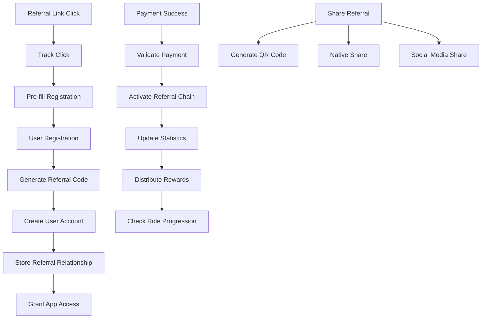
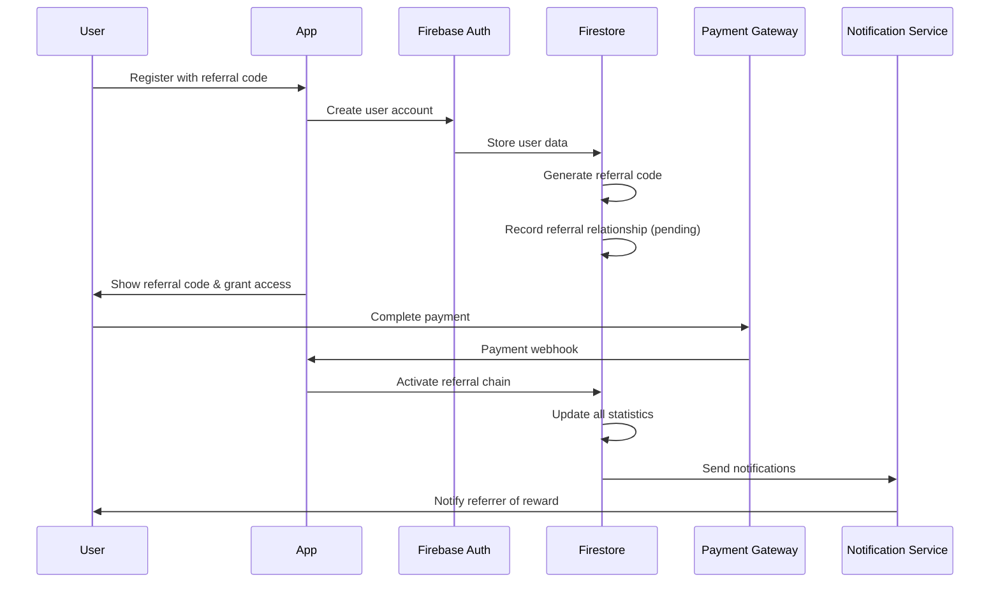

# TALOWA Referral System Design

## Overview

The TALOWA Referral System is designed as a high-performance, fraud-resistant, two-step referral mechanism that can scale to 5+ million users. The system separates user registration from payment confirmation, ensuring data integrity while providing immediate access to referral features.

## Architecture

### System Architecture Diagram



### Data Flow Architecture



## Components and Interfaces

### 1. Referral Code Generator

```dart
class ReferralCodeGenerator {
  static const String PREFIX = 'TAL';
  static const int CODE_LENGTH = 6;
  static const String ALLOWED_CHARS = '23456789ABCDEFGHJKMNPQRSTUVWXYZ';
  
  /// Generates a unique referral code
  static Future<String> generateUniqueCode() async {
    int attempts = 0;
    const maxAttempts = 3;
    
    while (attempts < maxAttempts) {
      final code = _generateRandomCode();
      final isUnique = await _checkCodeUniqueness(code);
      
      if (isUnique) {
        await _reserveCode(code);
        return code;
      }
      attempts++;
    }
    
    throw ReferralCodeGenerationException('Failed to generate unique code');
  }
  
  static String _generateRandomCode() {
    final random = Random.secure();
    final codeBuffer = StringBuffer(PREFIX);
    
    for (int i = 0; i < CODE_LENGTH; i++) {
      final randomIndex = random.nextInt(ALLOWED_CHARS.length);
      codeBuffer.write(ALLOWED_CHARS[randomIndex]);
    }
    
    return codeBuffer.toString();
  }
}
```

### 2. Universal Link Handler

```dart
class UniversalLinkHandler {
  static const String BASE_URL = 'https://talowa.web.app';
  static const String JOIN_PATH = '/join';
  
  /// Generates universal referral link
  static String generateReferralLink(String referralCode) {
    return '$BASE_URL$JOIN_PATH?ref=$referralCode';
  }
  
  /// Handles incoming referral links
  static Future<void> handleReferralLink(String link) async {
    final uri = Uri.parse(link);
    final referralCode = uri.queryParameters['ref'];
    
    if (referralCode != null && referralCode.isNotEmpty) {
      await _trackReferralClick(referralCode);
      await _prefillRegistrationForm(referralCode);
    }
  }
  
  /// Platform-specific deep linking
  static Future<void> setupDeepLinking() async {
    if (kIsWeb) {
      _setupWebRouting();
    } else if (Platform.isAndroid) {
      _setupAndroidDeepLinks();
    } else if (Platform.isIOS) {
      _setupiOSUniversalLinks();
    }
  }
}
```

### 3. Referral Tracking Service

```dart
class ReferralTrackingService {
  static final FirebaseFirestore _firestore = FirebaseFirestore.instance;
  
  /// Records referral relationship (pending state)
  static Future<void> recordReferralRelationship({
    required String newUserId,
    required String referralCode,
  }) async {
    final batch = _firestore.batch();
    
    try {
      // Validate referral code
      final referrerData = await _validateReferralCode(referralCode);
      if (referrerData == null) {
        throw InvalidReferralCodeException('Invalid referral code: $referralCode');
      }
      
      // Update new user with referral info
      final userRef = _firestore.collection('users').doc(newUserId);
      batch.update(userRef, {
        'referredBy': referralCode,
        'referralChain': await _buildReferralChain(referrerData['uid']),
        'referralStatus': 'pending_payment',
        'referralRecordedAt': FieldValue.serverTimestamp(),
      });
      
      // Add to referrer's pending referrals
      final referrerRef = _firestore.collection('users').doc(referrerData['uid']);
      batch.update(referrerRef, {
        'pendingReferrals': FieldValue.arrayUnion([newUserId]),
      });
      
      await batch.commit();
      
      // Track referral event
      await _trackReferralEvent('referral_recorded', {
        'referrer_id': referrerData['uid'],
        'referee_id': newUserId,
        'referral_code': referralCode,
      });
      
    } catch (e) {
      await _logReferralError('record_referral_relationship', e, {
        'new_user_id': newUserId,
        'referral_code': referralCode,
      });
      rethrow;
    }
  }
  
  /// Activates referral chain after payment success
  static Future<void> activateReferralChain(String userId) async {
    final batch = _firestore.batch();
    
    try {
      final userDoc = await _firestore.collection('users').doc(userId).get();
      final userData = userDoc.data();
      
      if (userData == null || userData['referralStatus'] != 'pending_payment') {
        return; // No pending referral to activate
      }
      
      final referralCode = userData['referredBy'] as String?;
      if (referralCode == null) return;
      
      // Update user status
      batch.update(userDoc.reference, {
        'referralStatus': 'active',
        'paymentCompletedAt': FieldValue.serverTimestamp(),
      });
      
      // Update referral chain statistics
      await _updateReferralChainStatistics(batch, userData['referralChain'], userId);
      
      // Check for role progressions
      await _checkRoleProgressions(batch, userData['referralChain']);

      await batch.commit();

      // Send notifications
      await _sendReferralActivationNotifications(userData['referralChain'], userId);

      // Award achievements for milestones
      await _checkAndAwardAchievements(userData['referralChain']);

      // Generate recognition content for any promotions
      await _generateRecognitionContent(userData['referralChain']);
      
    } catch (e) {
      await _logReferralError('activate_referral_chain', e, {'user_id': userId});
      rethrow;
    }
  }
  
  /// Check and update role progressions for referral chain
  static Future<void> _checkRoleProgressions(WriteBatch batch, List<String> referralChain) async {
    for (final userId in referralChain) {
      final userDoc = await _firestore.collection('users').doc(userId).get();
      final userData = userDoc.data();
      if (userData == null) continue;
      
      final directReferrals = userData['directReferralCount'] as int? ?? 0;
      final teamSize = userData['totalTeamSize'] as int? ?? 0;
      final currentRole = userData['currentRole'] as String? ?? 'member';
      final location = userData['location'] as Map<String, dynamic>?;
      final isUrban = location?['type'] == 'urban';
      
      final newRole = _calculateNewRole(directReferrals, teamSize, currentRole, isUrban);
      
      if (newRole.toString() != currentRole) {
        batch.update(userDoc.reference, {
          'currentRole': newRole.toString(),
          'rolePromotedAt': FieldValue.serverTimestamp(),
          'previousRole': currentRole,
        });
        
        // Queue role promotion notification and recognition content
        await _queueRolePromotionNotification(userId, newRole, directReferrals, teamSize);
        await _queueRecognitionContent(userId, newRole, currentRole);
      }
    }
  }
  
  /// Calculate new role based on direct referrals and team size
  static UserRole _calculateNewRole(int directReferrals, int teamSize, String currentRole, bool isUrban) {
    if (directReferrals >= 1000 && teamSize >= 3000000) return UserRole.state_coordinator;
    if (directReferrals >= 500 && teamSize >= 1000000) return UserRole.zonal_regional_coordinator;
    if (directReferrals >= 320 && teamSize >= 500000) return UserRole.district_coordinator;
    if (directReferrals >= 160 && teamSize >= 50000) return UserRole.constituency_coordinator;
    if (directReferrals >= 80 && teamSize >= 6000) return UserRole.mandal_coordinator;
    if (directReferrals >= 40 && teamSize >= 700) {
      return isUrban ? UserRole.area_coordinator_urban : UserRole.village_coordinator_rural;
    }
    if (directReferrals >= 20 && teamSize >= 100) return UserRole.coordinator;
    if (directReferrals >= 10) return UserRole.team_leader;
    return UserRole.member;
  }
}

/// Orphan User Assignment Service
class OrphanAssignmentService {
  static final FirebaseFirestore _firestore = FirebaseFirestore.instance;
  static const double MAX_ASSIGNMENT_RADIUS_KM = 50.0;
  static const String ADMIN_USER_ID = 'admin_user_id'; // Configure admin user ID
  
  /// Assigns orphan users to nearest active leaders
  static Future<void> assignOrphanUser(String orphanUserId) async {
    try {
      final orphanDoc = await _firestore.collection('users').doc(orphanUserId).get();
      final orphanData = orphanDoc.data();
      
      if (orphanData == null || orphanData['referredBy'] != null) {
        return; // Not an orphan or already assigned
      }
      
      final orphanLocation = orphanData['location'] as Map<String, dynamic>?;
      if (orphanLocation == null) {
        await _assignToAdmin(orphanUserId, 'No location data');
        return;
      }
      
      // Find nearest active leader
      final nearestLeader = await _findNearestActiveLeader(orphanLocation);
      
      if (nearestLeader != null) {
        await _assignToLeader(orphanUserId, nearestLeader['uid'], nearestLeader);
      } else {
        await _assignToAdmin(orphanUserId, 'No leader within radius');
      }
      
    } catch (e) {
      await _logOrphanAssignmentError('assign_orphan_user', e, {'orphan_id': orphanUserId});
      // Fallback to admin assignment
      await _assignToAdmin(orphanUserId, 'Assignment error: ${e.toString()}');
    }
  }
  
  /// Find nearest active leader within radius
  static Future<Map<String, dynamic>?> _findNearestActiveLeader(Map<String, dynamic> orphanLocation) async {
    final orphanLat = orphanLocation['latitude'] as double?;
    final orphanLng = orphanLocation['longitude'] as double?;
    
    if (orphanLat == null || orphanLng == null) return null;
    
    // Query users with leadership roles
    final leadersQuery = await _firestore
        .collection('users')
        .where('currentRole', whereIn: [
          'team_leader',
          'coordinator',
          'area_coordinator_urban',
          'village_coordinator_rural',
          'mandal_coordinator',
          'constituency_coordinator',
          'district_coordinator',
          'zonal_regional_coordinator',
          'state_coordinator'
        ])
        .where('isActive', isEqualTo: true)
        .get();
    
    Map<String, dynamic>? nearestLeader;
    double nearestDistance = double.infinity;
    
    for (final leaderDoc in leadersQuery.docs) {
      final leaderData = leaderDoc.data();
      final leaderLocation = leaderData['location'] as Map<String, dynamic>?;
      
      if (leaderLocation == null) continue;
      
      final leaderLat = leaderLocation['latitude'] as double?;
      final leaderLng = leaderLocation['longitude'] as double?;
      
      if (leaderLat == null || leaderLng == null) continue;
      
      final distance = _calculateDistance(orphanLat, orphanLng, leaderLat, leaderLng);
      
      if (distance <= MAX_ASSIGNMENT_RADIUS_KM && distance < nearestDistance) {
        // Check if this leader is better (higher role or smaller team)
        if (_isBetterLeader(leaderData, nearestLeader, distance, nearestDistance)) {
          nearestLeader = {...leaderData, 'uid': leaderDoc.id, 'distance': distance};
          nearestDistance = distance;
        }
      }
    }
    
    return nearestLeader;
  }
  
  /// Check if current leader is better than previous best
  static bool _isBetterLeader(
    Map<String, dynamic> currentLeader,
    Map<String, dynamic>? previousBest,
    double currentDistance,
    double previousDistance,
  ) {
    if (previousBest == null) return true;
    
    final currentRoleLevel = _getRoleLevel(currentLeader['currentRole']);
    final previousRoleLevel = _getRoleLevel(previousBest['currentRole']);
    
    // Prefer higher role level
    if (currentRoleLevel > previousRoleLevel) return true;
    if (currentRoleLevel < previousRoleLevel) return false;
    
    // Same role level - prefer smaller team size
    final currentTeamSize = currentLeader['totalTeamSize'] as int? ?? 0;
    final previousTeamSize = previousBest['totalTeamSize'] as int? ?? 0;
    
    if (currentTeamSize < previousTeamSize) return true;
    if (currentTeamSize > previousTeamSize) return false;
    
    // Same team size - prefer closer distance
    return currentDistance < previousDistance;
  }
  
  /// Get numeric role level for comparison
  static int _getRoleLevel(String role) {
    switch (role) {
      case 'state_coordinator': return 9;
      case 'zonal_regional_coordinator': return 8;
      case 'district_coordinator': return 7;
      case 'constituency_coordinator': return 6;
      case 'mandal_coordinator': return 5;
      case 'area_coordinator_urban':
      case 'village_coordinator_rural': return 4;
      case 'coordinator': return 3;
      case 'team_leader': return 2;
      case 'member': return 1;
      default: return 0;
    }
  }
  
  /// Calculate distance between two coordinates using Haversine formula
  static double _calculateDistance(double lat1, double lng1, double lat2, double lng2) {
    const double earthRadius = 6371; // Earth's radius in kilometers
    
    final dLat = _degreesToRadians(lat2 - lat1);
    final dLng = _degreesToRadians(lng2 - lng1);
    
    final a = sin(dLat / 2) * sin(dLat / 2) +
        cos(_degreesToRadians(lat1)) * cos(_degreesToRadians(lat2)) *
        sin(dLng / 2) * sin(dLng / 2);
    
    final c = 2 * atan2(sqrt(a), sqrt(1 - a));
    
    return earthRadius * c;
  }
  
  static double _degreesToRadians(double degrees) {
    return degrees * (pi / 180);
  }
  
  /// Assign orphan to specific leader
  static Future<void> _assignToLeader(String orphanUserId, String leaderId, Map<String, dynamic> leaderData) async {
    final batch = _firestore.batch();
    
    try {
      // Generate referral code for the leader if not exists
      final leaderReferralCode = leaderData['referralCode'] as String?;
      if (leaderReferralCode == null) {
        throw Exception('Leader does not have referral code');
      }
      
      // Update orphan user
      final orphanRef = _firestore.collection('users').doc(orphanUserId);
      batch.update(orphanRef, {
        'referredBy': leaderReferralCode,
        'referralChain': await _buildReferralChain(leaderId),
        'referralStatus': 'auto_assigned',
        'assignedAt': FieldValue.serverTimestamp(),
        'assignmentType': 'geo_proximity',
        'assignmentDistance': leaderData['distance'],
      });
      
      // Update leader's pending referrals
      final leaderRef = _firestore.collection('users').doc(leaderId);
      batch.update(leaderRef, {
        'pendingReferrals': FieldValue.arrayUnion([orphanUserId]),
        'autoAssignedCount': FieldValue.increment(1),
      });
      
      await batch.commit();
      
      // Send notifications
      await _sendOrphanAssignmentNotifications(orphanUserId, leaderId, leaderData);
      
      await _logOrphanAssignmentSuccess(orphanUserId, leaderId, leaderData['distance']);
      
    } catch (e) {
      await _logOrphanAssignmentError('assign_to_leader', e, {
        'orphan_id': orphanUserId,
        'leader_id': leaderId,
      });
      rethrow;
    }
  }
  
  /// Assign orphan to admin as fallback
  static Future<void> _assignToAdmin(String orphanUserId, String reason) async {
    try {
      final orphanRef = _firestore.collection('users').doc(orphanUserId);
      await orphanRef.update({
        'referredBy': 'ADMIN',
        'referralChain': [ADMIN_USER_ID],
        'referralStatus': 'admin_assigned',
        'assignedAt': FieldValue.serverTimestamp(),
        'assignmentType': 'admin_fallback',
        'assignmentReason': reason,
      });
      
      // Notify admin
      await _sendAdminOrphanNotification(orphanUserId, reason);
      
      await _logOrphanAssignmentSuccess(orphanUserId, ADMIN_USER_ID, null);
      
    } catch (e) {
      await _logOrphanAssignmentError('assign_to_admin', e, {
        'orphan_id': orphanUserId,
        'reason': reason,
      });
    }
  }
}

/// Recognition and Retention Service
class RecognitionService {
  static final FirebaseFirestore _firestore = FirebaseFirestore.instance;
  static final FirebaseStorage _storage = FirebaseStorage.instance;

  /// Generate comprehensive recognition content for role promotion
  static Future<void> generatePromotionRecognition({
    required String userId,
    required UserRole newRole,
    required String previousRole,
    required int directReferrals,
    required int teamSize,
  }) async {
    try {
      // Generate promotion certificate
      final certificateUrl = await _generatePromotionCertificate(
        userId: userId,
        newRole: newRole,
        previousRole: previousRole,
        achievementDate: DateTime.now(),
      );

      // Create achievement badge
      final badgeData = await _createAchievementBadge(newRole);

      // Prepare celebration content
      final celebrationContent = await _prepareCelebrationContent(
        newRole: newRole,
        directReferrals: directReferrals,
        teamSize: teamSize,
      );

      // Update user profile with recognition data
      await _updateUserRecognitionProfile(
        userId: userId,
        certificateUrl: certificateUrl,
        badgeData: badgeData,
        newRole: newRole,
      );

      // Trigger celebration UI
      await _triggerCelebrationUI(userId, celebrationContent);

      // Send team notifications
      await _sendTeamPromotionNotifications(userId, newRole);

      // Unlock role-specific features
      await _unlockRoleFeatures(userId, newRole);

      // Prepare social sharing content
      await _prepareSocialSharingContent(userId, newRole, certificateUrl);

    } catch (e) {
      await _logRecognitionError('generate_promotion_recognition', e, {
        'user_id': userId,
        'new_role': newRole.toString(),
        'previous_role': previousRole,
      });
    }
  }

  /// Generate downloadable promotion certificate
  static Future<String> _generatePromotionCertificate({
    required String userId,
    required UserRole newRole,
    required String previousRole,
    required DateTime achievementDate,
  }) async {
    // Get user data for certificate
    final userDoc = await _firestore.collection('users').doc(userId).get();
    final userData = userDoc.data()!;

    // Create certificate data
    final certificateData = {
      'userId': userId,
      'userName': userData['fullName'],
      'userPhoto': userData['profilePhotoUrl'],
      'newRole': newRole.toString(),
      'previousRole': previousRole,
      'achievementDate': achievementDate.toIso8601String(),
      'certificateId': _generateCertificateId(),
      'digitalSignature': await _generateDigitalSignature(userId, newRole),
      'movementLogo': 'assets/images/talowa_logo.png',
      'backgroundTemplate': _getRoleBackgroundTemplate(newRole),
    };

    // Generate certificate image/PDF
    final certificateBytes = await _renderCertificate(certificateData);

    // Upload to Firebase Storage
    final fileName = 'certificates/${userId}_${newRole.toString()}_${DateTime.now().millisecondsSinceEpoch}.pdf';
    final uploadTask = _storage.ref(fileName).putData(certificateBytes);
    final snapshot = await uploadTask;
    final downloadUrl = await snapshot.ref.getDownloadURL();

    // Store certificate record
    await _firestore.collection('certificates').add({
      'userId': userId,
      'role': newRole.toString(),
      'downloadUrl': downloadUrl,
      'createdAt': FieldValue.serverTimestamp(),
      'certificateId': certificateData['certificateId'],
    });

    return downloadUrl;
  }

  /// Create achievement badge for new role
  static Future<Map<String, dynamic>> _createAchievementBadge(UserRole role) async {
    return {
      'badgeId': 'role_${role.toString()}',
      'title': _getRoleTitle(role),
      'description': _getRoleDescription(role),
      'iconUrl': 'assets/badges/role_${role.toString()}.svg',
      'color': _getRoleColor(role),
      'earnedAt': DateTime.now().toIso8601String(),
      'rarity': _getRoleRarity(role),
    };
  }

  /// Prepare celebration animation and content
  static Future<Map<String, dynamic>> _prepareCelebrationContent({
    required UserRole newRole,
    required int directReferrals,
    required int teamSize,
  }) async {
    return {
      'animationType': 'confetti_burst',
      'soundEffect': 'achievement_fanfare.mp3',
      'celebrationMessage': 'Congratulations! You\'ve been promoted to ${_getRoleTitle(newRole)}!',
      'achievementStats': {
        'directReferrals': directReferrals,
        'teamSize': teamSize,
        'newResponsibilities': _getRoleResponsibilities(newRole),
        'newBenefits': _getRoleBenefits(newRole),
      },
      'duration': 5000, // 5 seconds
      'colors': ['#FFD700', '#FF6B35', '#F7931E'], // Gold, orange, amber
    };
  }

  /// Update user profile with recognition data
  static Future<void> _updateUserRecognitionProfile({
    required String userId,
    required String certificateUrl,
    required Map<String, dynamic> badgeData,
    required UserRole newRole,
  }) async {
    await _firestore.collection('users').doc(userId).update({
      'currentRole': newRole.toString(),
      'rolePromotedAt': FieldValue.serverTimestamp(),
      'latestCertificateUrl': certificateUrl,
      'badges': FieldValue.arrayUnion([badgeData]),
      'achievementTimeline': FieldValue.arrayUnion([{
        'type': 'role_promotion',
        'role': newRole.toString(),
        'timestamp': FieldValue.serverTimestamp(),
        'certificateUrl': certificateUrl,
      }]),
    });
  }

  /// Trigger celebration UI in the app
  static Future<void> _triggerCelebrationUI(String userId, Map<String, dynamic> content) async {
    // Send real-time notification to trigger celebration
    await _firestore.collection('celebrations').add({
      'userId': userId,
      'content': content,
      'status': 'pending',
      'createdAt': FieldValue.serverTimestamp(),
      'expiresAt': DateTime.now().add(Duration(hours: 24)),
    });
  }

  /// Send promotion notifications to team members
  static Future<void> _sendTeamPromotionNotifications(String userId, UserRole newRole) async {
    final userDoc = await _firestore.collection('users').doc(userId).get();
    final userData = userDoc.data()!;
    final userName = userData['fullName'];

    // Notify direct referrals
    final directReferrals = userData['directReferrals'] as List<dynamic>? ?? [];
    for (final referralId in directReferrals) {
      await _sendNotification(
        userId: referralId,
        title: 'Team Leader Promoted! 🎉',
        body: '$userName has been promoted to ${_getRoleTitle(newRole)}! Congratulations to our amazing leader!',
        data: {
          'type': 'team_leader_promotion',
          'promotedUserId': userId,
          'newRole': newRole.toString(),
        },
      );
    }

    // Notify upline chain
    final referralChain = userData['referralChain'] as List<dynamic>? ?? [];
    for (final uplineId in referralChain) {
      if (uplineId != userId) {
        await _sendNotification(
          userId: uplineId,
          title: 'Team Member Promoted! 🌟',
          body: '$userName in your network has been promoted to ${_getRoleTitle(newRole)}!',
          data: {
            'type': 'network_promotion',
            'promotedUserId': userId,
            'newRole': newRole.toString(),
          },
        );
      }
    }
  }

  /// Unlock role-specific features and permissions
  static Future<void> _unlockRoleFeatures(String userId, UserRole newRole) async {
    final roleFeatures = _getRoleFeatures(newRole);

    await _firestore.collection('users').doc(userId).update({
      'permissions': roleFeatures['permissions'],
      'accessLevel': roleFeatures['accessLevel'],
      'dashboardFeatures': roleFeatures['dashboardFeatures'],
      'communicationTools': roleFeatures['communicationTools'],
    });

    // Queue feature tour notification
    await _firestore.collection('featureTours').add({
      'userId': userId,
      'tourType': 'role_features_${newRole.toString()}',
      'features': roleFeatures,
      'status': 'pending',
      'createdAt': FieldValue.serverTimestamp(),
    });
  }

  /// Prepare social sharing content for promotion
  static Future<void> _prepareSocialSharingContent(String userId, UserRole newRole, String certificateUrl) async {
    final shareContent = {
      'title': 'Promoted to ${_getRoleTitle(newRole)} in TALOWA! 🎉',
      'description': 'Proud to be part of India\'s land rights movement and reach this milestone!',
      'imageUrl': await _generateSocialShareImage(userId, newRole),
      'certificateUrl': certificateUrl,
      'hashtags': ['#TALOWA', '#LandRights', '#Leadership', '#${newRole.toString()}'],
      'platforms': ['whatsapp', 'facebook', 'twitter', 'linkedin', 'instagram'],
    };

    await _firestore.collection('socialShares').add({
      'userId': userId,
      'content': shareContent,
      'type': 'role_promotion',
      'status': 'ready',
      'createdAt': FieldValue.serverTimestamp(),
    });
  }

  /// Helper methods for role-specific content
  static String _getRoleTitle(UserRole role) {
    switch (role) {
      case UserRole.team_leader: return 'Team Leader';
      case UserRole.coordinator: return 'Coordinator';
      case UserRole.area_coordinator_urban: return 'Area Coordinator (Urban)';
      case UserRole.village_coordinator_rural: return 'Village Coordinator (Rural)';
      case UserRole.mandal_coordinator: return 'Mandal Coordinator';
      case UserRole.constituency_coordinator: return 'Constituency Coordinator';
      case UserRole.district_coordinator: return 'District Coordinator';
      case UserRole.zonal_regional_coordinator: return 'Zonal/Regional Coordinator';
      case UserRole.state_coordinator: return 'State Coordinator';
      default: return 'Member';
    }
  }

  static List<String> _getRoleResponsibilities(UserRole role) {
    switch (role) {
      case UserRole.team_leader:
        return ['Lead team of 10+ members', 'Mentor new recruits', 'Organize local activities'];
      case UserRole.coordinator:
        return ['Coordinate multiple teams', 'Plan regional campaigns', 'Train team leaders'];
      case UserRole.area_coordinator_urban:
        return ['Manage urban area operations', 'Coordinate with local authorities', 'Lead community outreach'];
      case UserRole.village_coordinator_rural:
        return ['Manage rural village operations', 'Work with village councils', 'Organize farmer meetings'];
      default:
        return ['Support team growth', 'Participate in movement activities'];
    }
  }

  static List<String> _getRoleBenefits(UserRole role) {
    switch (role) {
      case UserRole.team_leader:
        return ['Access to leadership dashboard', 'Team management tools', 'Priority support'];
      case UserRole.coordinator:
        return ['Advanced analytics', 'Campaign planning tools', 'Regional network access'];
      default:
        return ['Recognition badge', 'Achievement certificate', 'Community status'];
    }
  }

  static Map<String, dynamic> _getRoleFeatures(UserRole role) {
    // Return role-specific features, permissions, and access levels
    return {
      'permissions': _getRolePermissions(role),
      'accessLevel': _getAccessLevel(role),
      'dashboardFeatures': _getDashboardFeatures(role),
      'communicationTools': _getCommunicationTools(role),
    };
  }
}
```

### 4. QR Code and Sharing Service

```dart
class ReferralSharingService {
  /// Generates branded QR code
  static Future<Uint8List> generateBrandedQRCode(String referralLink) async {
    final qrValidationResult = QrValidator.validate(
      data: referralLink,
      version: QrVersions.auto,
      errorCorrectionLevel: QrErrorCorrectLevel.M,
    );
    
    final qrCode = qrValidationResult.qrCode!;
    final painter = QrPainter.withQr(
      qr: qrCode,
      color: const Color(0xFF2E7D32), // TALOWA green
      emptyColor: Colors.white,
      gapless: false,
      embeddedImageStyle: QrEmbeddedImageStyle(
        size: const Size(60, 60),
      ),
    );
    
    final picData = await painter.toImageData(300);
    return picData!.buffer.asUint8List();
  }
  
  /// Enhanced sharing with platform detection
  static Future<void> shareReferralLink(String referralCode, String referralLink) async {
    final message = '''🌟 Join TALOWA - India's Land Rights Movement!

Use my referral code: $referralCode
Download: $referralLink

Together we can secure land rights for all! 🏡

#TALOWA #LandRights #India''';
    
    try {
      if (kIsWeb) {
        await _shareOnWeb(referralLink, message);
      } else {
        await Share.share(
          message,
          subject: 'Join TALOWA Movement',
          sharePositionOrigin: const Rect.fromLTWH(0, 0, 100, 100),
        );
      }
      
      // Track sharing event
      await _trackSharingEvent(referralCode, 'native_share');
      
    } catch (e) {
      // Fallback to copy to clipboard
      await Clipboard.setData(ClipboardData(text: message));
      await _showCopyConfirmation();
    }
  }
  
  /// Web-specific sharing with social media integration
  static Future<void> _shareOnWeb(String referralLink, String message) async {
    await showDialog(
      context: navigatorKey.currentContext!,
      builder: (context) => WebShareDialog(
        referralLink: referralLink,
        message: message,
        onPlatformShare: (platform) async {
          final encodedMessage = Uri.encodeComponent(message);
          final encodedLink = Uri.encodeComponent(referralLink);
          
          String shareUrl;
          switch (platform) {
            case 'whatsapp':
              shareUrl = 'https://wa.me/?text=$encodedMessage';
              break;
            case 'telegram':
              shareUrl = 'https://t.me/share/url?url=$encodedLink&text=$encodedMessage';
              break;
            case 'twitter':
              shareUrl = 'https://twitter.com/intent/tweet?text=$encodedMessage';
              break;
            case 'facebook':
              shareUrl = 'https://www.facebook.com/sharer/sharer.php?u=$encodedLink';
              break;
            default:
              return;
          }
          
          await _launchUrl(shareUrl);
          await _trackSharingEvent(referralLink, platform);
        },
      ),
    );
  }
}
```

## Data Models

### User Model (Enhanced)

```dart
class User {
  final String uid;
  final String fullName;
  final String phone;
  final Location location;
  
  // Referral Data
  final String referralCode;
  final String? referredBy;
  final List<String> referralChain;
  final ReferralStatus referralStatus;
  
  // Statistics
  final List<String> directReferrals;
  final List<String> pendingReferrals;
  final int totalTeamSize;
  final int directReferralCount;
  
  // Metadata
  final DateTime registrationDate;
  final DateTime? paymentCompletedAt;
  final DateTime lastActive;
  final UserRole currentRole;
  final UserRole? previousRole;
  final DateTime? rolePromotedAt;
  final bool isActive;
  
  // Achievements
  final List<Achievement> achievements;
  final List<Milestone> milestones;
}

enum ReferralStatus {
  pending_payment,
  active,
  suspended,
  cancelled
}

enum UserRole {
  member,
  team_leader,
  coordinator,
  area_coordinator_urban,
  village_coordinator_rural,
  mandal_coordinator,
  constituency_coordinator,
  district_coordinator,
  zonal_regional_coordinator,
  state_coordinator
}

class Achievement {
  final String id;
  final String title;
  final String description;
  final String iconUrl;
  final DateTime earnedAt;
  final AchievementType type;
}

enum AchievementType {
  role_promotion,
  referral_milestone,
  team_milestone,
  special_recognition
}

class Milestone {
  final String id;
  final String title;
  final int targetValue;
  final int currentValue;
  final MilestoneType type;
  final bool isCompleted;
  final DateTime? completedAt;
}

enum MilestoneType {
  direct_referrals,
  team_size,
  monthly_growth,
  retention_rate
}
```

### Referral Code Lookup Model

```dart
class ReferralCodeLookup {
  final String code;
  final String uid;
  final bool isActive;
  final DateTime createdAt;
  final DateTime? deactivatedAt;
  final int clickCount;
  final int conversionCount;
}
```

### Referral Analytics Model

```dart
class ReferralAnalytics {
  final String userId;
  final String period; // daily, weekly, monthly
  final DateTime date;
  
  // Click Metrics
  final int linkClicks;
  final int uniqueClicks;
  final Map<String, int> clicksBySource;
  
  // Conversion Metrics
  final int registrations;
  final int paidConversions;
  final double conversionRate;
  
  // Geographic Data
  final Map<String, int> clicksByLocation;
  final Map<String, int> conversionsByLocation;
  
  // Performance
  final double viralCoefficient;
  final int networkGrowth;
}
```

## Error Handling

### Custom Exceptions

```dart
class ReferralSystemException implements Exception {
  final String message;
  final String code;
  final Map<String, dynamic>? context;
  
  const ReferralSystemException(this.message, this.code, [this.context]);
}

class InvalidReferralCodeException extends ReferralSystemException {
  const InvalidReferralCodeException(String message) 
      : super(message, 'INVALID_REFERRAL_CODE');
}

class ReferralCodeGenerationException extends ReferralSystemException {
  const ReferralCodeGenerationException(String message) 
      : super(message, 'CODE_GENERATION_FAILED');
}

class PaymentVerificationException extends ReferralSystemException {
  const PaymentVerificationException(String message) 
      : super(message, 'PAYMENT_VERIFICATION_FAILED');
}
```

### Error Recovery Strategies

```dart
class ReferralErrorHandler {
  static Future<void> handleReferralError(
    String operation,
    Exception error,
    Map<String, dynamic> context,
  ) async {
    // Log error with context
    await FirebaseCrashlytics.instance.recordError(
      error,
      StackTrace.current,
      information: [
        'Operation: $operation',
        'Context: ${jsonEncode(context)}',
      ],
    );
    
    // Queue for retry if applicable
    if (_isRetryableError(error)) {
      await _queueForRetry(operation, context);
    }
    
    // Send alert for critical errors
    if (_isCriticalError(error)) {
      await _sendCriticalErrorAlert(operation, error, context);
    }
  }
  
  static bool _isRetryableError(Exception error) {
    return error is FirebaseException && 
           (error.code == 'unavailable' || error.code == 'deadline-exceeded');
  }
}
```

## Testing Strategy

### Unit Tests

```dart
group('ReferralCodeGenerator', () {
  test('should generate valid referral code format', () {
    final code = ReferralCodeGenerator.generateCode();
    expect(code, startsWith('TAL'));
    expect(code.length, equals(9)); // TAL + 6 chars
    expect(code, matches(RegExp(r'^TAL[23456789ABCDEFGHJKMNPQRSTUVWXYZ]{6}$')));
  });
  
  test('should generate unique codes', () async {
    final codes = <String>{};
    for (int i = 0; i < 1000; i++) {
      final code = await ReferralCodeGenerator.generateUniqueCode();
      expect(codes.contains(code), isFalse);
      codes.add(code);
    }
  });
});

group('ReferralTrackingService', () {
  test('should record referral relationship correctly', () async {
    // Setup test data
    final referrerUid = 'referrer123';
    final newUserUid = 'newuser456';
    final referralCode = 'TAL8K9M2X';
    
    // Mock Firestore
    when(mockFirestore.collection('referralCodes').doc(referralCode).get())
        .thenAnswer((_) async => mockDocumentSnapshot({
          'uid': referrerUid,
          'isActive': true,
        }));
    
    // Execute
    await ReferralTrackingService.recordReferralRelationship(
      newUserId: newUserUid,
      referralCode: referralCode,
    );
    
    // Verify
    verify(mockFirestore.batch().commit()).called(1);
  });
});
```

### Integration Tests

```dart
group('Referral System Integration', () {
  testWidgets('complete referral flow', (tester) async {
    // 1. User clicks referral link
    await tester.tap(find.byKey(const Key('referral_link')));
    await tester.pumpAndSettle();
    
    // 2. Registration form should be pre-filled
    expect(find.text('TAL8K9M2X'), findsOneWidget);
    
    // 3. Complete registration
    await tester.enterText(find.byKey(const Key('name_field')), 'Test User');
    await tester.enterText(find.byKey(const Key('phone_field')), '+919876543210');
    await tester.tap(find.byKey(const Key('register_button')));
    await tester.pumpAndSettle();
    
    // 4. Should show referral code
    expect(find.textContaining('Your referral code:'), findsOneWidget);
    
    // 5. Complete payment
    await tester.tap(find.byKey(const Key('payment_button')));
    await tester.pumpAndSettle();
    
    // 6. Verify referral activation
    // This would involve checking Firestore state
  });
});
```

### Performance Tests

```dart
group('Referral System Performance', () {
  test('should handle concurrent referral code generation', () async {
    final futures = List.generate(100, (_) => 
        ReferralCodeGenerator.generateUniqueCode());
    
    final stopwatch = Stopwatch()..start();
    final codes = await Future.wait(futures);
    stopwatch.stop();
    
    expect(codes.toSet().length, equals(100)); // All unique
    expect(stopwatch.elapsedMilliseconds, lessThan(5000)); // Under 5 seconds
  });
  
  test('should update referral chain efficiently', () async {
    // Test with deep referral chain (10 levels)
    final stopwatch = Stopwatch()..start();
    await ReferralTrackingService.activateReferralChain('test_user');
    stopwatch.stop();
    
    expect(stopwatch.elapsedMilliseconds, lessThan(30000)); // Under 30 seconds
  });
});
```

## Security Considerations

### Fraud Prevention

1. **Device Fingerprinting**: Track device characteristics to detect multiple accounts
2. **IP Address Monitoring**: Flag suspicious patterns from same IP
3. **Behavioral Analysis**: Monitor registration and payment patterns
4. **Manual Review Queue**: Flag suspicious activities for human review
5. **Rate Limiting**: Limit referral code generation and usage rates

### Data Protection

1. **PII Encryption**: Encrypt sensitive personal information
2. **Access Controls**: Role-based access to referral data
3. **Audit Logging**: Log all referral system operations
4. **Data Retention**: Implement data retention policies
5. **GDPR Compliance**: Support data export and deletion requests

## Monitoring and Alerting

### Key Metrics

1. **Referral Conversion Rate**: Percentage of referral clicks that convert to paid users
2. **Viral Coefficient**: Average number of new users each user brings
3. **Network Growth Rate**: Speed of referral network expansion
4. **Payment Activation Rate**: Percentage of registered users who complete payment
5. **Fraud Detection Rate**: Percentage of fraudulent activities caught

### Alerts

1. **High Error Rate**: Alert when referral operations fail above threshold
2. **Fraud Detection**: Immediate alert for suspected fraudulent activity
3. **Performance Degradation**: Alert when response times exceed limits
4. **Payment Integration Issues**: Alert for payment webhook failures
5. **Database Performance**: Alert for slow queries or high load

This design provides a comprehensive, production-ready foundation for the TALOWA referral system that can scale to millions of users while maintaining data integrity and preventing fraud.