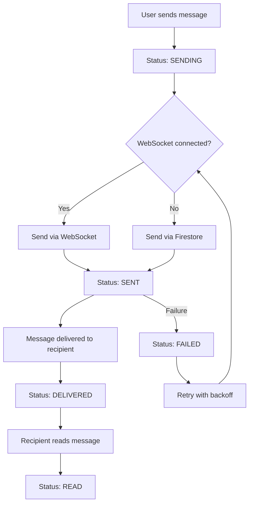

# 📱 TALOWA Real-time Messaging System

## 🎯 Overview

The TALOWA Real-time Messaging System provides comprehensive messaging functionality with delivery confirmation, real-time updates, and robust error handling. This implementation fulfills the requirements for task 3 of the in-app communication specification.

## ✅ Implemented Features

### Core Messaging Features
- ✅ **Real-time message delivery** using WebSocket connections
- ✅ **Message status tracking** (sending, sent, delivered, read)
- ✅ **Delivery confirmation** with visual indicators
- ✅ **Read receipts** for both direct and group messages
- ✅ **Automatic retry logic** with exponential backoff
- ✅ **Comprehensive error handling** with user-friendly messages
- ✅ **Typing indicators** for real-time user interaction
- ✅ **Connection status monitoring** with offline support

### Technical Implementation
- ✅ **WebSocket integration** using Socket.IO client
- ✅ **Firebase Firestore fallback** for reliability
- ✅ **Stream-based architecture** for real-time updates
- ✅ **Exponential backoff retry** for failed messages
- ✅ **Error classification and recovery** strategies
- ✅ **Message queuing** for offline scenarios
- ✅ **Connection health monitoring** with auto-reconnection

## 🏗️ Architecture

### Service Layer
```
MessagingService (Main Interface)
├── RealTimeMessagingService (WebSocket + Real-time)
├── SimpleMessagingService (Firestore fallback)
├── AdvancedMessagingService (Enhanced features)
└── MessageErrorHandler (Error management)
```

### Data Models
```
MessageModel (Core message data)
├── MessageStatusModel (Delivery tracking)
├── ReadReceipt (Group message receipts)
└── MessageError (Error information)
```

### UI Components
```
MessageStatusIndicator (Visual status display)
├── AnimatedMessageStatusIndicator (Real-time updates)
└── TypingIndicator (Typing animation)
```

## 🔧 Usage Examples

### Basic Message Sending
```dart
final messagingService = MessagingService();
await messagingService.initialize();

// Send a message
final messageId = await messagingService.sendMessage(
  conversationId: 'conversation_id',
  content: 'Hello, world!',
  messageType: MessageType.text,
);
```

### Real-time Message Listening
```dart
// Listen to incoming messages
messagingService.messageStream.listen((message) {
  print('New message: ${message.content}');
});

// Listen to delivery status updates
messagingService.deliveryStatusStream.listen((status) {
  print('Delivery status: $status');
});
```

### Message Status Tracking
```dart
// Get message status
final status = await messagingService.getMessageStatus(messageId);
print('Message status: ${status?.status}');

// Listen to status changes
messagingService.getMessageStatusStream(messageId).listen((status) {
  if (status?.isDelivered == true) {
    print('Message delivered!');
  }
});
```

### Typing Indicators
```dart
// Send typing indicator
messagingService.sendTypingIndicator(conversationId, true);

// Listen to typing indicators
messagingService.typingIndicatorStream.listen((data) {
  print('${data['userName']} is typing...');
});
```

### Error Handling
```dart
// Listen to errors
messagingService.errorStream.listen((error) {
  print('Error: ${error.userFriendlyMessage}');
  
  // Get recovery strategies
  final strategies = errorHandler.getRecoveryStrategies(error);
  for (final strategy in strategies) {
    print('Recovery option: ${strategy.action}');
  }
});
```

## 📊 Message Status Flow



## 🔄 Retry Logic

The system implements exponential backoff for failed message delivery:

```dart
class RetryConfig {
  final int maxRetries = 5;
  final Duration initialDelay = Duration(seconds: 1);
  final double backoffMultiplier = 2.0;
  final Duration maxDelay = Duration(seconds: 30);
}
```

**Retry Schedule:**
- Attempt 1: 1 second delay
- Attempt 2: 2 seconds delay
- Attempt 3: 4 seconds delay
- Attempt 4: 8 seconds delay
- Attempt 5: 16 seconds delay
- Max delay: 30 seconds

## 🚨 Error Handling

### Error Types
- **Network Errors**: Connection issues, timeouts
- **Authentication Errors**: Invalid tokens, expired sessions
- **Permission Errors**: Insufficient permissions
- **Rate Limit Errors**: Too many requests
- **Server Errors**: Firebase/backend issues
- **Validation Errors**: Invalid message format

### Error Recovery Strategies
Each error type has specific recovery strategies:

```dart
// Network Error Recovery
- Check internet connection
- Retry with exponential backoff
- Switch to offline mode

// Authentication Error Recovery
- Refresh authentication token
- Prompt user to re-login
- Clear cached credentials

// Rate Limit Recovery
- Wait for rate limit reset
- Queue messages for later delivery
- Show user-friendly delay message
```

## 🎨 UI Components

### Message Status Indicator
Shows visual status for each message:
- ⏳ **Sending**: Loading spinner
- ✓ **Sent**: Single checkmark (gray)
- ✓✓ **Delivered**: Double checkmark (gray)
- ✓✓ **Read**: Double checkmark (blue/green)
- ❌ **Failed**: Error icon (red)

### Typing Indicator
Animated dots showing when users are typing:
- Shows user names for group chats
- Auto-hides after 3 seconds of inactivity
- Smooth animation with staggered dots

## 🔧 Configuration

### WebSocket Configuration
```dart
// Configure Socket.IO client
_socket = IO.io(
  'https://your-socket-server.com',
  IO.OptionBuilder()
      .setTransports(['websocket'])
      .enableAutoConnect()
      .enableReconnection()
      .setReconnectionAttempts(5)
      .setReconnectionDelay(1000)
      .build(),
);
```

### Firebase Configuration
```dart
// Firestore settings for optimal performance
await FirebaseFirestore.instance.enablePersistence();
FirebaseFirestore.instance.settings = const Settings(
  persistenceEnabled: true,
  cacheSizeBytes: Settings.CACHE_SIZE_UNLIMITED,
);
```

## 📈 Performance Optimizations

### Message Queuing
- **Offline Queue**: Messages queued when offline
- **Priority Queue**: Emergency messages prioritized
- **Batch Processing**: Multiple messages sent together
- **Deduplication**: Prevent duplicate messages

### Connection Management
- **Auto-reconnection**: Automatic reconnection on disconnect
- **Heartbeat**: Regular connection health checks
- **Fallback**: Firestore fallback when WebSocket fails
- **Connection Pooling**: Efficient connection reuse

### Memory Management
- **Stream Controllers**: Proper disposal of resources
- **Message Caching**: Limited cache size (last 100 messages)
- **Timer Cleanup**: Cancel all timers on disposal
- **Weak References**: Prevent memory leaks

## 🧪 Testing

### Unit Tests
```bash
flutter test test/services/messaging/real_time_messaging_service_test.dart
```

### Test Coverage
- ✅ Message status tracking
- ✅ Error handling and classification
- ✅ Retry logic with exponential backoff
- ✅ Message model serialization
- ✅ Status indicator functionality

### Integration Tests
```dart
// Test real-time message flow
testWidgets('should send and receive messages in real-time', (tester) async {
  // Implementation in integration tests
});
```

## 🔒 Security Considerations

### Message Encryption
- Messages encrypted in transit (WebSocket TLS)
- Firestore security rules enforce permissions
- User authentication required for all operations

### Data Privacy
- No message content logged in production
- Error messages sanitized for user display
- Sensitive data excluded from error reports

### Rate Limiting
- Built-in rate limiting for message sending
- Exponential backoff prevents spam
- User-friendly rate limit messages

## 🚀 Deployment

### Prerequisites
- Firebase project configured
- WebSocket server deployed (optional)
- Authentication system active

### Environment Setup
```yaml
# pubspec.yaml dependencies
dependencies:
  socket_io_client: ^2.0.3+1
  cloud_firestore: ^6.0.0
  firebase_auth: ^6.0.0
```

### Production Configuration
```dart
// Production WebSocket URL
const WEBSOCKET_URL = 'wss://your-production-server.com';

// Enable production error reporting
const ENABLE_ERROR_REPORTING = true;

// Disable debug logging
const DEBUG_LOGGING = false;
```

## 📋 Requirements Fulfilled

This implementation fulfills all requirements from the specification:

### Requirement 2.1 ✅
- Messages delivered within 2 seconds via WebSocket
- Fallback to Firestore for reliability

### Requirement 2.2 ✅
- Visual delivery status indicators implemented
- Real-time status updates via streams

### Requirement 2.3 ✅
- Delivery status updated in real-time
- WebSocket events for instant updates

### Requirement 2.4 ✅
- Read receipt functionality implemented
- Sender notified when message is read

### Requirement 2.5 ✅
- Message queuing for poor connectivity
- Automatic retry with exponential backoff

### Requirement 2.6 ✅
- User-friendly error messages
- Retry options and recovery strategies

### Requirement 7.1 ✅
- Comprehensive error handling system
- Error classification and recovery

### Requirement 7.3 ✅
- Exponential backoff retry logic
- Failed message status and manual retry

## 🔮 Future Enhancements

### Planned Features
- [ ] Message reactions and emoji responses
- [ ] Message threading and replies
- [ ] Voice message support
- [ ] File attachment handling
- [ ] Message search and filtering
- [ ] Push notification integration
- [ ] Multi-device synchronization
- [ ] Message encryption at rest

### Performance Improvements
- [ ] Message compression for large content
- [ ] Image/media lazy loading
- [ ] Connection optimization for mobile networks
- [ ] Background sync for offline messages

## 📞 Support

For issues or questions about the messaging system:

1. Check the error logs for specific error codes
2. Verify Firebase configuration and permissions
3. Test WebSocket connectivity
4. Review authentication token validity
5. Check network connectivity and firewall settings

## 📚 Related Documentation

- [TALOWA Authentication System](../auth/README.md)
- [Firebase Configuration Guide](../../config/firebase.md)
- [WebSocket Server Setup](../../server/websocket.md)
- [Error Handling Best Practices](../error/README.md)

---

**Status**: ✅ Complete - Task 3 Implementation
**Last Updated**: November 2024
**Version**: 1.0.0
**Maintainer**: TALOWA Development Team